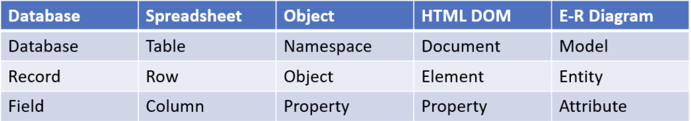

# IT & C 210: Web Systems and Security

## 1. Introduction

**Command Line Interface**
Some basic CLI commands that are new to me:

- `ifconfig` : show the configurations for the current IP address
- `passwd` : change the password for the current user
- `apt-get` : package manager for Ubuntu
- `chmod` : change the permissions for a file or directory
- `chown` : change the owner of a file or directory
- `ssh` : secure shell to connect to a remote server (remote into another machine securely)
- `scp` : secure copy to copy files from one machine to another

- A note about the `chmod` command:
mode: Specifies the permissions to set. You can define these either in numeric form or symbolic form:
Numeric (octal) mode: Permissions are represented by a three-digit number (e.g., 755, 644).
- 4 = Read (r)
- 2 = Write (w)
- 1 = Execute (x)

For git commands, one way to connect a local repository to a remote repository is to use the `git remote add origin <url>` command. This will add a remote repository to the local repository, and then you can use the `git push` command to push the local repository to the remote repository. Sometimes the command `git push origin main` is needed. Also try using the `-u` flag with the `git push` command to set the upstream branch.
**Lecture 9/4 Introduction**
This is a gateway class, not a weed-out class. Prof. Redd doesn't like or believe in weed-out courses which is good.

IT requires self-learning. All of the programming languages used in this class, with exception to SQL, Professor Redd had to learn after he graduated, outside of a formal programming class. I will likely have to do the same in my career.

Prof Redd actually expects me to jump on Google and find things out in the moment during class. Give myself a green light to go and do that.

Expectations for the readings are that they are not required, they are simply to supplement what I learn in class and give me extra help for homework and labs if I need it.

> As I looked at the syllabus, I had a moment of anxiety about the pace of the class, if it is too fast, and about if I will really be able to learn all that I don't know. I remembered and recognized that not knowing much of the subject matter on day 1 is exactly the point! If I knew it all on day 1, that would make this whole following semester a waste of my time. The first day/week *should* be full of not knowing the subjects, but getting glimpses and ideas of what I will learn and what those things mean. Then I simply take those and learn with diligent, enthusiam, curiousity, and meekness/humility.

**Rhythm of the Class:**

- Monday:
    Lecture, Demo, live Q&A
    Lab period
- Wednesday:
    Lecture
    Lab period, TA Kickoff the next lab
    Lab pass-off due for the previous lab
- Friday:
    Lecture
    In-class quiz (some weeks)
    Homework or Lab write-up due (alternating weeks)

Keys to success: ***Integrity and Persistence***

### Some HTML Stuff

HTML is a declarative language, which means that information is simply given, and then something else (in this case a browser) interprets and renders the information that is "declared" in the HTML file.

A useful website is the [Markup Validation Service](https://validator.w3.org/), which will check your HTML code for errors and give you feedback on how to fix them, based on widely accepted web standards.

The `DOCTYPE` usually is where the HTML version is declared. Typing `html` simply defaults the DOCTYPE to the latest version of HTML. This is important because the version of HTML affects some of the default structures.

> There is no good reason to use a previous HTML version, according to Prof. Redd.

A good way to think about `head` and `body` elements, is that the `head` element contains metadata, and the `body` contains data.

> Git submodules are a way to include a repository within another repository.

## Lecture Notes

### Lecture 9/6: HTML and CSS

HTML
: Runtime Model: interpreted (parsed into Document Object Model)
Object oriented: each HTML element becomes an object in the DOM

HTML elements can be roughly grouped into 4 groups:

1. Metadata: includes elements like `title`, `meta`, `link`, `style`, and `script`. These all appear in the `head` element.
2. Functional and Structural Markup: Dictatces the function and structure of the document. Includes `html`, `head`, `body`, `header`, `footer`, `div`, `span` and others
3. Semantic Markup: Includes elements like `h1` to `h6`, `p`, `code` and others.
4. Visual markup: `bold`, `italic`, `u`, `em`,`strong`, `</br>` and others. These are generally not used, because CSS is used to style the document instead.

Some terminology:
An HTML element is all of the tags and content between the opening and closing tags. The attributes are extra information stated in the opening tag of an element.

A CSS styling statement is called a *rule*. A rule has a *selector*, which focuses in on a *property* and then gives it a *value*.

Super good website for CSS tutorials: [W3Schools CSS Tutorial](https://www.w3schools.com/css/default.asp)

The `transition` property in CSS is used to change the property of an element gradually. It is a shorthand property for the four transition properties: `transition-property`, `transition-duration`, `transition-timing-function`, and `transition-delay`.
An example of this property being used in a CSS rule is:

```css
div {
  width: 100px;
  height: 100px;
  background: red;
  transition: width 2s;
}

div:hover {
  width: 300px;
}
```

What this does is make the width of the `div` element change from 100px to 300px over a 2 second period when the mouse hovers over the `div` element. The syntax for the transition property is `transition: property duration timing-function delay;`.

### Lecture 9/8: Git, Markdown, WSL and Docker

Git is a VCS (Version Control System). It is like the Google Drive of programming (according to Reagan lol). It tracks all of the changes made to tracked files, saves you from mistakes and hardware/software failures, allows with collaborations, and allows you to go back to previous versions of your code.

Some lingo:

- Remote: a shared copy of a repo on a managed service like GitHub or GitLab
- Push: copying commits from a local to a remote
- Pull: retrieve *and* merge commits from a remote
- Sync: pull and then push
- Branch: commits in the same repo, but not on or affecting the main branch
- Fork: A copy of the entire repo, on a remote
- Pull request: a request for a repo manager to merge in commits from a branch or a fork.

Git Remote Hosts:

- GitHub (most popular)
- Atlassian Bitbucket (also quite popular)
- SourceForge
- GitLab

**Docker:**

Containers
: Like a lightweight virtual machine in which libraries and aapplications can be installed. This isolates the application from the host machine, to prevent conflicts. Containers are also less resource-intensive than VMs.

Unlike a VM, a container can share resources with the host machine, like the RAM, CPU, and storage.
Docker is the most popular container host.

- Docker-compose.yml files load one or more containers and connect them using virtural networks or shared file mappings.
- DOCKERFILE is a set of instructions to create a new container, usually by editing an existing container.

### Lecture 9.11.24: CSS

Reminder of CSS selectors: [Basic Selectors](./udemyNotes.md#css-selectors) and [Combining Selectors](./udemyNotes.md#combining-css-selectors)

Reminder of CSS units: [CSS Units](www.w3schools.com/cssref/css_units.asp)

To set variables in CSS, use the `--` prefix. For example:

```css
body{
  --main-bg-color: #ff0000;
  background-color: var(--main-bg-color);
}
```

Remember, the first line in that CSS rule doesn't actually do anything, because it is not in 'property: value' format. It is simply setting a variable. The second line is what actually uses the variable and sets its value to a property.

Usually I'll want to set variables in the `body` element, because that will make their scope the entirety of the visible content. The scope of CSS varibles is the element in which they are set, and all of its children.

I already know about `block` and `inline` display types, but I learned that there are certain html elements that have default display types. Block elements include `div`, `p`, and `table`. Inline elements include `span`, `a`, `em`, and `img`.

Reminders on margin, border, and padding:

- Margin is the space from the border of an element to the border of the next element, or the edge of the screen.
- Border is the line that surrounds the element.
- Padding is the space between the border of an element and the content of the element.

>Something interesting that I noticed as I worked on hw2 was the annoying dependency that was created between element positions when I used absolute positioning. Anytime I wanted to slightly edit an element, I would have to edit the position of several others. Something I'll need to look out for in the future is avoiding that, and knowing how to manage it. I think a better understanding of how the CSS positioning properties work will help me with that.

To get a decent walkthrough on getting a 5-box layout using different CSS methods, [click here](https://byu-itc-210.github.io/walkthrough/FiveBoxCss)

### Lecture 9.13.24: Javascipt Intro

**`var`, `let`, and `const`**

| **Keyword** | **Scope**       | **Hoisting** | **Redeclarable** | **Reassignable** |
|-------------|-----------------|--------------|------------------|------------------|
| `var`       | Function scope  | Yes          | Yes              | Yes              |
| `let`       | Block scope     | No           | No               | Yes              |
| `const`     | Block scope     | No           | No               | No               |

Just like CSS, Javascript can be place inline using certain Javascript attributes (like `onmouseover`), internally using a `script` element, or externally by having a `link` element to a `.js` file.

Hoisting
: The process of moving variable and function declarations to the top of their containing scope during the compilation phase. *Initialization*, or initial assignment, is not hoisted. So, a variable can be accessed without throwing a breaking error, but the value will be `undefined`.

Only variables can be declared or instantiated more than once. Functions can only be declared once, but can be reassigned.

Using `use strict` at the top of a script will make the script run in strict mode, which will not allow variables to be declared without the `var`, `let`, or `const` keywords.

`let` and `const` don't get hoisted, so they can't be accessed before they are declared. This is a good thing, because it prevents bugs.

According to Prof. Redd, functions are just code assigned to variables.

### Lecture 9.16.24: DOM and DOM Events

W3C
: World Wide Web Consortium. The main international standards organization for the World Wide Web.

Any time `innerHTML` is used, it is a security risk, so be aware of that. Someone could inject malicious code into the `innerHTML` property of an element.

Be careful of `getElementsbyName` and `getElementsbyTagName`. The naming can be deceiving, as `getElementsbyName` returns based on the `name` attribute, and `getElementsbyTagName` returns based on the name of the actual HTML element.

Anatomy of Event Handling:

```javascript
<button onclick= "PlayMusic()">
```

- `button` is the DOM element, or the HTML element that the event is attached to.
- `onclick` is the event that is being listened for, or the thing that triggers the code to execute.
- `PlayMusic()` is the code that is executed when the event is triggered.

There are lots of events that can be listened for, like `click`, `mouseover`, `mouseout`, `keydown`, `keyup`, `keypress`, `load`, `resize`, `scroll`, `select`, `submit`, `change`, `focus`, `blur`, and many others.

An event listener is a function that performs an action based on a specific event. It waits for an event to occur, and then executes the code that is associated with that event. This code example above is an example of an event listener.

The method `addEventListener()` is used to attach an event handler to an element. The other way to attach an event handler is to use the `on` attribute in the HTML element. So, the actual event name is `click`, and 'onclick' is an attribute that is used to attach an event handler to an element inline.

`document.createElement()` is a method that creates an HTML element. Created elements are not displayed until they are added to the DOM tree by using the `appendChild()` method.

`window` is the global object in a browser, and it represents the browser window. It can be accessed and manipulated in the DOM.

>Random Markdown note: when making internal links, use # and then the name of the heading, in all lowercase and with spaces replaced by hyphens. For example, to link to the heading "DOM and DOM Events", use `#dom-and-dom-events`. Only one # is needed, regardless of the heading level.

### Lecture 9.18.24: Javascript Object Notation (JSON)

JSON
: JavaScript Object Notation. A "syntax for storing and exchanging text information". Similar to XML, but faster, easier to parse, and like XML is language and platform independent.

JSON info from language card:

- Property names are case sensitive and dynamically typed
- It is a declarative language since it is just data representation, runtime model is interpreted
- For sytanx, each 'object' is represented by braces `{}` and arrays are represented by brackets `[]`. The property name and value must be in double quotes, and a colon always separates the property from the value, and a comma separate a pair from another pair: `{ "Name": "John", "Name": "Simon: }`.
- Pure JSON doesn't allow comments, but lots of JSON parsers allow JS comments.
- JSON is object oriented in that it defines objects and arrays to be manipulated by another programming language.
- JSON is a subset of JS and can be embedded directly into JS code. It is likely the most popular data representation language, right up there with CSV.

- JavaScript has a JSON object that has its own methods. A JavaScript object can be converted to JSON using the `JSON.stringify()` method, and a JSON object can be converted to a JavaScript object using the `JSON.parse()` method.

- When JSON is converted to a JavaScript object, because JSON uses objects and properties, the JavaScript object functions just like any other programming class/object, and the properties can be accessed using dot notation.

- The `preventDefault()` method is used to prevent the default action of an event from happening. For example, if a form is submitted, the default is to send the data to the server and refresh, but sometimes that is not desired.

- The `.target` property of an event object is a reference to the object that dispatched or triggered the event.

- The `Object` object is a global object that is used to create objects. It has a number of built-in methods that are used to manipulate objects. For example, the `.fromEntries()` method is used to create an object from an array of key-value pairs. When passed in a `FormData` it will return an object with a property for each of the entries, with the value being the value of the entry.

localStorage
: String data that can be stored on a webpage between page refreshes and browser sessions. It is stored in the browser, and can be accessed using the `localStorage` object. Each distinct URL has its own local storage, and the data is stored as key-value pairs.

sessionStorage
: String data similar to localStorage, with the exception that it is cleared when the browser is closed. Different tabs have different sessionStorages, even if they are on the same URL. Similar to localStorage, it is accessed using the `sessionStorage` object.

The storage for a website can be viewed in the browser's developer tools, under the `Application` tab.

### Lecture 9.20.24: Networking

Local Area Network (LAN)
: A set of computers connected by some medium (wire, radio, hub, router, etc.). Each device on the LAN can access any other device on the LAN, and can broadcast to all other devices on the LAN.

An internet
: A set of LANs connected by routers. Routers bridge between each LAN, deciding where to send certain packets, and which packets don't move.

The Internet
: the internet that connects most of the world.

Tier 1 Network/ISP
: The top level of Internet Protocol (IP) networks, which can reach each other without paying for transit. They are the backbone of the internet. Examples include AT&T, Verizon, and Sprint in the USA, and others like NTT in Japan. A full list can be found [here](https://en.wikipedia.org/wiki/Tier_1_network).

MA: Multiple Access
: A communication protocol that allows multiple devices to share a single communication line or channel. Capacity is limited because too many packets being sent at once can cause collisions.

CSMA: Carrier Sense Multiple Access
: A protocol that listens to the channel before transmitting data. If the channel is busy, the device waits for a random amount of time before trying again. This one change increases the capacity of the channel significantly from simple MA

CSMA/CD: Carrier Sense Multiple Access with Collision Detection
: Behaves the same as CSMA, listening before transmitting, but also listens while transmitting. If what is heard during transmission is different from what is sent, a collision has occurred. The device then stops transmitting and waits a random amount of time before trying again.

CSMA/CD + Switches: Contemporary Local Area Networks (LAN)
: Get definition later

Other MA Protocols:

- FDMA: Frequency Division Multiple Access
  Always a part of wireless/broadband systems
- TDMA: Time Division Multiple Access
  Used in 2G cell phone systems
- CDMA: Code Division Multiple Access
  Used in 3G cell phone systems
- OFDMA: Orthogonal Frequency Division Multiple Access
  Used in 4G, 5G cell phone systems and WiFi 6.

OSI model: Open Systems Interconnection model
: A conceptual framework that standardizes the functions of a telecommunication or computing system into seven abstraction layers. Each layer serves the layer above it and is served by the layer below it. The layers are: Physical, Data Link, Network, Transport, Session, Presentation, and Application.

Turns out that OSI is all theory and not practiced. Only TCP/IP is used in practice.

TCP/IP model: Transmission Control Protocol/Internet Protocol model
: A model that is used to describe the functions of a networking system. It is a five-layer model that includes the Application, Transport, Internetwork(IP), Link(Network accesss), and Physical layers. The TCP/IP model is used to describe the functions of the internet.

Layer 4 and up is mostly software. Layer 3 is where routing happenes. Networks, hubs, switches, and access points are all layer 2 devices. Layer 1 is the physical layer, and is the actual hardware that is used to transmit data, like cables, fiber, and radio waves.

Hub vs Switch:

- Hub: Broadcasts all packets to all devices on the network.
- Switch: Only sends packets to the device that the packet is intended for.
- Switches are more efficient than hubs, because they don't broadcast all packets to all devices.
- Switches are more complicated than hubs, and they need to know the MAC address of the devices on the network to send packets to the correct device.
- Max capacity of a hub is the capacity of the network, because it broadcasts all packets to all devices. The max capacity of a switch is the capacity of the network times the number of ports on the switch times 2.

Switch vs Router:

- Switches are used to connect devices on the same network, and routers are used to connect devices on different networks.
- Switches are a layer 2 device, and routers are a layer 3 device.
- Switches use MAC addresses to send packets to the correct device, and routers use IP addresses to send packets to the correct network.

Layer 3 Network:

- Also known as Internet Protocol (IP)
- Data is sent in packets, thus a packet-switched network
- Packets may take different routes to the destination, and may even arrive out of order

Layer 4 Transport:

UDP: Universal Datagram Protocol vs TCP: Terminal Control Protocol

- Both rely on IP
- TCP is reliable (retries as needed), and UDP is not (best-effort)
- TCP is connection-oriented, and UDP is message-oriented
- Ordered delivery is guaranteed with TCP, but UDP is unordered delivery
- TCP has flow control, but UDP does not
- TCP includes a port number, UDP just adds a port number to the Ip address

In a packet-switched network, each router needs to decide which router to send the packet to next. This is done by looking at the destination IP address of the packet, and then looking at the routing table to decide which router to send the packet to next.

IPv4 Addresses
: IP addresses with 4 binary bytes, or 32 bits. Each byte is separated by a period, and each byte can have a value between 0 and 255. There are 2^32 possible IPv4 addresses, but many are reserved for special purposes.

IPv6 Addresses
: IP addresses with 8 hexadecimal bytes, or 128 bits. Each byte is separated by a colon, and each byte can have a value between 0 and FFFF. There are 2^128 possible IPv6 addresses, which is a lot more than IPv4.

Network Ports
: A 16 bit, 2 byte number that is used to identify a specific process or network service. Used by TCP and UDP, in combination with an IP address, to identify a specific transfer process on a specific device.

Some CLI commands for networks:

- `ifconfig` : show the configurations for the current IP address
- `ping <domain name or IP address>` : send a packet to the passed domain or IP address to see if the device is reachable, and in how long
- `traceroute <domain name or IP address>` : show the route that packets take to get to the passed domain or IP address, and how long each hop takes
- `netstat` : show the network connections, routing tables, interface statistics, masquerade connections, and multicast memberships

### Lecture 9.22.24: HTTP and HTTPS

World Wide Web (WWW)
: A set of documents and other filed linked together by hyperlinks, hosted and made available by web servers, and accessed by web clients.

WWW documents/resources are accessed using the HTTP protocol.

WWW is *not* the internet, and it is *not* a computer network.

Simple/essential parts of a URL:

- Protocol: `http` or `https`
- Domain: `www.google.com`
- Path: `/search?q=itc210`

More detailed parts of a URL:

- Includes three above parts but also:
- Subdomain: `.video.google.com`
- Port: `:80` or `:443`
- Query and parameters: `?q=itc210`
- Fragment: `#section1`

HTTP Protocol
: Hypertext Transfer Protocol. A pull protocol, meaning it is initiated by the client, that uses TCP to transfer hypertext resources from a server to a client. It is a stateless protocol, meaning that each request is independent of the others.

Example HTTP *request*:

```HTTP
GET /index.html HTTP/1.1
Host: www.example.com
Accept: text/html
Accept-Language: en-us
Accept-Encoding: gzip, deflate
User-Agent: Mozilla/4.0
Content-Length: 35

name=John+Doe&age=25&occupation=student
```

The first line is called the **request line** which includes the HTTP method that is being used, and the path to the resource that method is being called on, as well as the query string with information, such as form responses. The next lines are the request headers, which are key-value pairs that give the server more information about the request. Then there is a blank line which separates the header from the body. The body contains the data that is being sent to the server.

Example HTTP *Response*:

```HTTP
HTTP/1.1 200 OK
Date: Mon, 23 Sep 2024 12:00:00 GMT
Server: Apache/2.4.7
Last-Modified: Mon, 23 Sep 2024 11:00:00 GMT
ETag: "10000000565a5-2c-50d4d31b45040"
Accept-Ranges: bytes
Content-Length: 35
Connection: close
Content-Type: text/html

<!DOCTYPE html>
```

The structure of the response is the same as the request message, only the request line is replaced with the **status line**, which includes the HTTP version, and the response code for the request. The rest of the message follows the same format: headers, a blank line, and the body.

HTTP with form data: the `method` attribute of a form element determines which HTTP method is used. The `action` attribute determines the URL that the form data is sent to. The `enctype` attribute determines how the form data is encoded before it is sent to the server. The default value for the `enctype` attribute is `application/x-www-form-urlencoded`, which is used to encode form data as key-value pairs separated by `&` and spaces are replaced by `+`. The `multipart/form-data` value is used to send binary data, like files, to the server.

With a GET method, the form data is sent in the query string of the URL. With a POST method, the form data is sent in the body of the request.

HTTP Status Codes:

- 1xx: Informational
- 200: OK, request is fulfilled
- 3xx: Redirection
- 400: Client Error
- 401: Authentication required
- 403: Forbidden
- 404: Not Found
- 408: Request Timeout
- 500: Server Error (bug in server code)
- 503: Service Unavailable (server is down or overloaded)

HTTP Methods:

- GET: Retrieve data from the server. Payload must be textual data in the query string.
- PUT: Send data to the server to update a resource. Payload can be text data or binary.
- POST: Send data to the server. Payload can be text data or binary.

HTTPS Protocol
: Hypertext Transfer Protocol Secure. An ***extension of*** HTTP that is used to secure the communication between a client and a server. It uses SSL/TLS to encrypt the data that is sent between the client and the server. Request and Reponse messaging and methods are the same as HTTP.

TLS is what authenticates the server with a certificate, and then encrypts the data that is sent between the client and the server. The certificate is issued by a Certificate Authority (CA), and is used to verify that the server is who it says it is.

### Notes from Lab 2A

When FormData is converted into a JSON string, the value of the `name` attriburte of the form elements is used as the key in the JSON object, and the value of the form element is used as the value in the JSON object.

>Current problems: `updateStorage(newData)` is only putting the first element of the array into local storage. I need to figure out how to put the whole array into local storage.

Okay, so some janky stuff. Although `localStorage` only ever shows the first array element when I call it in the console, when I call `createTask()` it shows the whole array of items. In other words, when I assign the return value of `readStorage()` to a new array, it shows the whole of the array. I think that something about the `localStorage` object make it only display the first element when I call it in the console.

`.find()` is another method that can be used on arrays using the syntax that was used with `.map()`. It returns the first element in the array that satisfies the condition in the callback function. Here is the syntax used: `array.find(element => condition)`. Element was essentially used like the iterator in a for loop.

`.splice()` is another handy JS array method. It is used to add or remove elements from an array. The syntax is `array.splice(start, deleteCount, item1, item2, item3)`. `start` is the index at which to start changing the array, `deleteCount` is the number of elements to remove from the array, and `item1`, `item2`, and `item3` are the elements to add to the array. If `deleteCount` is 0, no elements are removed from the array. The items to delete parameters are optional, and if no items to add are passed in, it simply removes the elements from the array (as long as deleteCount is not 0).

A couple of final notes: I had to assign a function to the onload event for the window object. In reality, I should've opened my notes about event handling in JS, and I probably could've come up with the code more easily.

Second, to bug fix the styles, I simply had to make sure the right CSS classes and HTML attributes were being applied by the JavaScript, since the `checked` HTML attribute was what dictated the check icon showing up on the checkbox.

### Lecture 9.25.24: UML and Debugging

UML
: Unified Modeling Language. A family of certain graphical notations, with an overarching model, that help in describing and designing software systems, particularly object oriented ones.

From my CS202 notes:

The need for graphic modeling languages stems from the fact that programming languages are not quite abstract enough to foster discussions about design. So, using a graphical modeling language allows for those discussions to happen

For lots of details about Activity Diagrams, [here are my 202 notes](./UML%20Activity%20Diagrams.md)

[Here are my notes about Class Diagrams](./umlClassDiagrams.md)

### Lab 2B Notes

BASH stands for Bourne Again SHell. It is a command language interpreter that is used in Unix and Unix-like operating systems. It is a shell that is used to execute commands, and is the default shell for most Linux distributions. Bash scripts are text files that contain a series of commands that are executed by the Bash shell.

The syntax is pretty simple, since you just type in the commands that you would normally type into the terminal. The only difference is that you can use variables, loops, and conditionals in a Bash script. You also start every script with `#!/bin/bash` to tell the system that the script should be executed by the Bash shell. Variables are named like most programming langauges, and when referenced a `$` is used before the variable name.

### Lecture 9.27.24: SQL

Types of Databases:

- Hierarchical: Mostly obsolete
- Relational: Most common and popular, uses tables. Examples include MySQL, PostgreSQL, Oracle, Microsoft SQL Server, and SQLite.
- Specialty and Custom Databases: Used for specific applications. Includes directory systems like Active Directory LDAP Databases, and Full-Text Databases like Elasticsearch or Google Search
- "NoSQL" Database: MongoDB, Cassandra, CouchDB, and others.

Relational databases are what we will use in class. It means that there are relationship between the data. Even separates can be linked.

SQL
: Structured Query Language. A standard language for accessing databases. It is an underlying languaged used by many Relation Database Management Systems (RDBMS). Not case sensitive. Clauses are introduced by keywords in all caps(by convention). Comments are done using `--` or `/* */`. Strongly typed.

Simple SQL Queries:

- `SELECT`: Used to select which column (field) of data from a database to access
- `FROM`: Used to select which table to access the data from
- `WHERE`: Used to filter the data that is returned
- `ORDER BY`: Used to sort the data that is returned
- `GROUP BY`: Used to group the data that is returned
- `DESC`: Used to sort the data in descending order

Aggregate Functions:

- `COUNT()`: Returns the number of rows that match the query
- `SUM()`: Returns the sum of the values in a column
- `AVG()`: Returns the average of the values in a column
- `MIN()`: Returns the minimum value in a column
- `MAX()`: Returns the maximum value in a column

SQL Joins:

- `INNER JOIN`: Returns records that have matching values in both tables
- `LEFT JOIN`: Returns all records from the left table, and the matched records from the right table
- `RIGHT JOIN`: Returns all records from the right table, and the matched records from the left table
- `OUTER JOIN`: Returns all records when there is a match in either left or right table

### Lecture 9.30.24: PHP

The LAMP Stack
: A technology stack for web development that consists of Linux, Apache, MySQL, and PHP. It is used to host dynamic websites and web applications.

The highest volume websites don't use PHP, but a lot of websites do still use php.

Why a server-side language?

- Security: Client-side code can be seen by anyone, and can be manipulated by anyone. Server-side code is executed on the server, and the results are sent to the client.
- Performance: Server-side code can be optimized to run faster than client-side code.
- Session tracking
- Database access
- Use of libraries that work well for things like emails

PHP:

- Imperative languages
- Interpreted runtime model
- Variables are case sensitive and dynamically typed
- Syntax: `<?php ?>`
- Uses curly braces like C++, Java
- PHP is object oriented, and has classes and objects

Because PHP is exectuted on the server, when viewing a php site in the browser, the code is not visible in the browser, the file is just rendered with the resulting HTML. So any variables used won't appear, just the values that they evaluate to.

Switching in and out of PHP when incorporating HTML into the code is difficult and hard to read. A better alternative is to just `echo` HTML text needed.

`htmlspecialchars()` is a function that is used to convert special characters to HTML entities. This is used to prevent XSS attacks, where a user inputs malicious code into a form that is then executed on the server. This should be used whenever you display info from your database. So if someone inserted a script tag, or code inside of an element attribute, it would be displayed as text, not executed.

Associative arrays are essentially like dictionaries. The keys are assigned on the left, and are pointed to the values using `=>`. To index into a key-value pair, use the key in square brackets and single quotes.

`$_GET` is a superglobal variable that is used to send form data in a query string after submitting an HTML form with the `method="get"` attribute. It is an associative array that contains the key-value pairs of the form data. The key is the name of the form element, and the value is the value of the form element. It also gets data from query strings, with the key being on the left side of the `=` in the query string, and value being on the right side.

`$_POST` is a superglobal variable that is used to send form data in the body of the HTTP request after submitting an HTML form with the `method="post"` attribute. It is an associative array that contains the key-value pairs of the form data. The key is the name of the form element, and the value is the value of the form element.

### Lecture 10.2.24: PHP with SQL

SQL Injection is when a user inputs into a field SQL code that is then executed on the server, which can perform malicious actions. Similar to XSS (cross site scripting attacks)

>All programming languages are based in English. Regardless of where you are, keywords are still in English.

A couple ways to protect against SQL injection:

- Good: use the escape string before inserting into a Query. This is done with the `real_escape_string()` method in PHP, and something similar in JS.

- Better: Prepared statements. This uses binding the parameters to a certain data type, using the `bind_param()` method in PHP. One of the parameters of the method is the data type of the parameter, which is a string that contains the data types of the parameters in the query. The data types are represented by a single character, with `s` representing a string, `i` representing an integer, and `d` representing a double. So, `bind_param("ss", $name, $email)` would bind the `$name` and `$email` variables to the query as strings.

- Articles on LS show lots of other methods. TODO: Grab links later

Here is a particularly useful table for terms used:


### Lecture 10.4.24: State, Cookies, and Sessions

HTTP is a stateless protocol, meaning that each request is independent of the others. This means that the server doesn't remember anything about the client between requests.

HTTP was made stateless because of the scale of the web, and the tech available at the time. Most computers only had memory in the MB range, not GBs of memory.

Included in the state of an application is different types of data (identity, authorization, working data like documents and projects, view state and much more), and the lifetime of the state (session lifetime, persistent lifetime).

The state resides in multiple places: the URL, Cookies, Server sessions, HTML Web storage like localStorage (persistent) and sessionStorage(session), or a server-side database(persistent).

Cookies
: A small text string stored in a browser area called a "cookie jar". They are name-value pairs that store data like expiration date, location, and source. Domain and path are stored as well.

**Types of Cookies:**

- *First party* cookies come from the domain you are visiting while *third party* cookies come from a different domain, usually advertisements and tracking (lots of browsers can be set to block 3rd party cookies, and now some do this by default).
- *Session* cookies are temporary and are deleted when the browser is closed, while *Persistent* cookies are stored on the user's computer in the browser for a longer time and remain when you revisit a site.

Cookies are used for session management, persistent personalization, and web analytics.

Cookies introduce various privacy and security concerns. 3rd party cookies track users across websites, but turning them off breaks some reputable sites, like Microsfot teams for example. Cookies can also be hijacked or forged, especially on http. Digital signatures can be used to prevent forgery.

The GDPR in the EU requires that websites get opt-in consent from EU citizens before using cookies, regardless of where they live, which is why opt in messages are seen on websites in the US too.

**Cookie Mechanics:**
Cookies can be disabled or cleared by users, and they are tied to a single browser. Cookies are passed in the HTTP headers.

Manipulating cookies can be done in PHP and JavaScript. In PHP, cookies are set using the `setcookie()` function, with the parameters being the name, value, expiration time, path, and domain. Cookies must be set before the `html` element is created. Cookies are retried using the `$_COOKIE` superglobal, with the key being the name of the cookie. To delete a cookie, the workaround is to set and expiration date in the past. In JavaScript, cookies are set and retrieved using the `document.cookie` property.

When manipulating cookies with JavaScript, using a library is helpful, like `cookiehelp.js` from the demo.

A new session can be created using the `session_start()` PHP function.

### Lecture 10.7.24: Principles of Learning

Learning Engineering
: A process and practice that applies learning sciences using human-centered engineering design methods and data-informed decision making, to support learners and their development.

Koedinger and his colleagues discovered that most everyone needs 7-8 learning opportunities to master a subject. This remarkable consistency in learning rate shows that there isn't really such thing as natural aptitude, just a difference in interest, which motivates seeking out those learning opportunities.

Intrinsic motivations are more powerful, particularly for cognitively demanding tasks. Extrinsic motivations can convert inheretly enjoyable tasks into chores, and can be detrimental to learning.

Autonomy, mastery, and purpose are the three key factors in motivation.

Growth mindset
: *belief* that skill and ability can be increased with effort and practice. Studies show that belief about ability to improved does affect future peformance.

Flow Channel
: Optimal state of skills and challenge. When the challenge is too high, anxiety results. When the challenge is too low, boredom results. Frustration is a result of both anxiety or boredom. When the challenge is just right, flow results.

### Lab 3A Notes

- Some important info that I got from this lab. One of the is that `session_start()` needs to be at the top of *every* PHP file that is going to access session variables.

- Another is how to redirect. The `header()` function is used to send a raw HTTP header to the browser. The syntax is `header("Location: url")`.

- Another useful bit of info is how the action and method attributes of a form element work. The action attribute is used to specify the URL that the form data is sent to, but can also be a subdirectory or file in the same directory as the form. The method attribute is used to specify the HTTP method that is used to send the form data, and must be in all lowercase, rather than the all caps syntax used to access those superglobal associative arrays.

### Lecture 10.9.24: Applied Cryptography

Cryptography
: The science of communicsteing with secret codes. Deals with 4 of the 5 core security services: confidentiality, integrity, authentication, and non-repudiation.

Encryption takes plain text to ciphertext, and decryption takes ciphertext to plain text. The key is used to encrypt and decrypt the data.

3 Main Types of Cryptographic Algorithms:

- Symmetric: Uses the same key to encrypt and decrypt the data. Examples include DES(Data Encryption Standard), AES(Advanced Encryption Standard), and Blowfish.
- Asymmetric: Uses a public key to encrypt the data, and a private key to decrypt the data. More secure because keys are longer. Someone can't decrypt data even if you have the public key. Is slower and harder to do. Examples include RSA(Revest-Shamir-Admin), DSA, and ECC.
- Hashing: Uses a hash function to convert data into a fixed length string of characters. Examples include MD5, SHA-1, and SHA-256.

Cryptography requires truly random numbers, which aren't found in Python random number generators, for example. Some sources of random numbers include quantum thermal noise, radioactive decay, and Cloudflare's LavaRand (which uses a wall of lava lamps).

Remember that a hash function should produce the same hash for the same string every time, and should produce a different hash for different strings. Hash functions are used to verify the integrity of data, and to create digital signatures. Hash collisions are when 2 *different* strings produce the same hash.

Because the digest (the output string) of a hash function *cannot* be reverted to the plaintext, the way to verify an input is to hash the input and compare it to the stored hash. The stored hash is stored when the document being sent is "signed". The hashes are compared when verifying the signature. The stored hash is usually encrypted, and then the person with the public key can decrypt the hash and compare it to the hash of the document.

Trust models are 3rd party entities that distribute public keys and maintain integrity. Some include PGP (Pretty Good Privacy) Web of Trust, Public Key Certificate Authorities, and Kerberos.

TLS
: Transport Layer Security. Provides both encryption (people can't see my data) and authentication (this server is what it says it is). HTTPS is just HTTP over TLS. TLS is the successor to SSL, and is frequently called SSL, though it is technically not the same.

TLS Handshake:

1. Client sends a `ClientHello` message to the server, which includes the client's supported cipher suites, compression methods, and a random number.
2. Server sends a `ServerHello` message to the client, which includes the server's supported cipher suite, compression method, and a random number.
3. Server sends a `Certificate` message to the client, which includes the server's certificate, which contains the server's public key.
4. Server sends a `ServerHelloDone` message to the client, which indicates that the server is done with the handshake.
5. Client sends a `ClientKeyExchange` message to the server, which includes the pre-master secret, which is encrypted with the server's public key.
6. Client sends a `ChangeCipherSpec` message to the server, which indicates that the client is switching to the newly negotiated cipher suite.
7. Client sends a `Finished` message to the server, which includes a hash of all the messages that have been exchanged so far.
